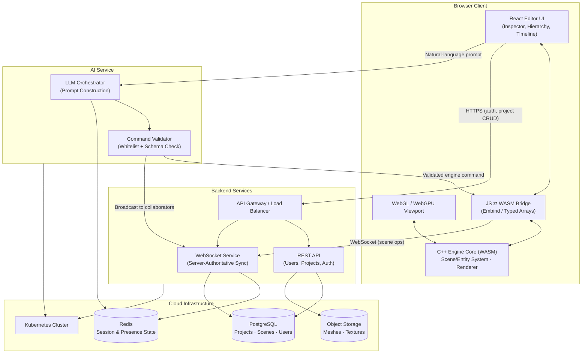
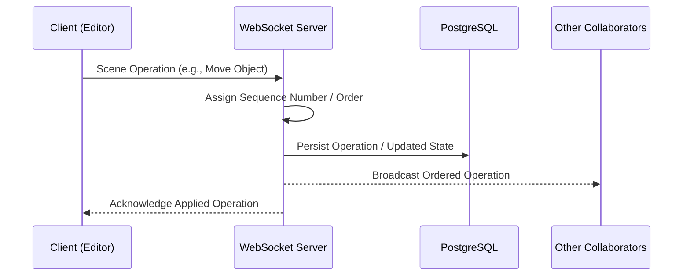
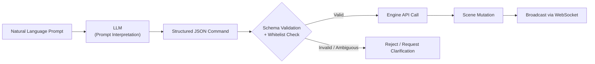
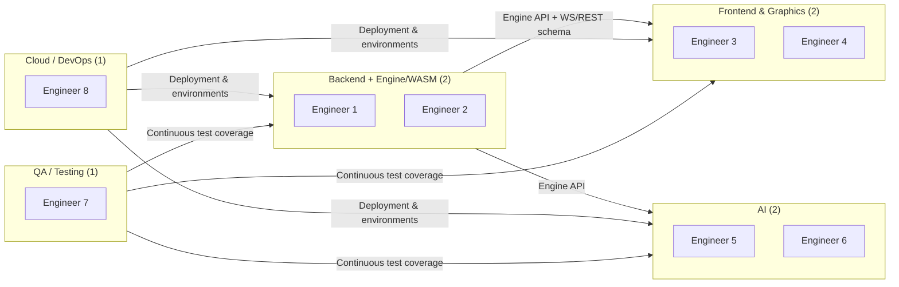
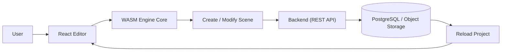
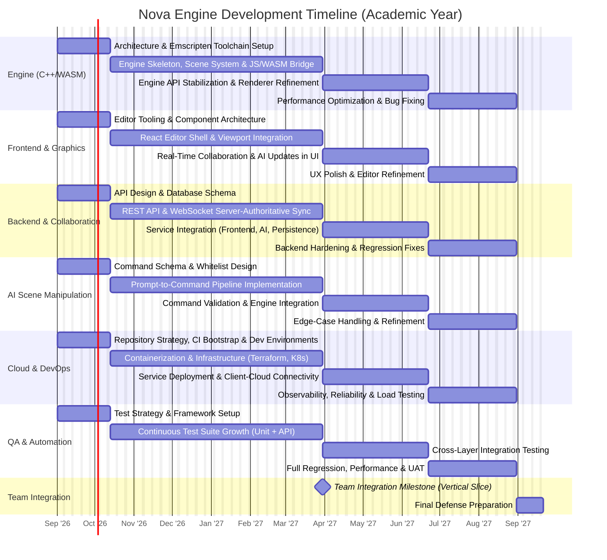

## 1. Abstract & Vision

Nova Engine is a browser-native, collaborative 3D game development platform built around a core engine written in **C++** and compiled to **WebAssembly (WASM)**, enabling near-native execution performance directly inside the browser without plugins or local installation. Users author scenes through a React-based editor whose viewport is driven by the WASM engine, collaborate with others in real time through a backend synchronization layer, and can manipulate the scene through natural language via an AI agent that emits validated, structured commands against the engine's own API.

Nova Engine is best understood as **one integrated system built by eight engineers across six interconnected technical areas**, each carrying substantial, independent ownership:

- **Engine (C++/WASM)** — the runtime and rendering core.
- **Frontend & Graphics** — the browser editor and viewport that expose the engine to users.
- **Backend & Distributed Collaboration** — persistence and real-time multi-user synchronization.
- **AI Scene Manipulation** — translating natural language into safe, deterministic engine operations.
- **Cloud Infrastructure & DevOps** — the deployment, scalability, reliability, and operational foundation that allows the other five areas to run as one cloud-based system.
- **QA & Automation** — verification of correctness and stability across every layer above.

To keep this ambition deliverable within a single academic year, the project is **deliberately scoped around a fully working Minimum Viable Product (MVP)**, with advanced refinements reserved as explicit stretch goals (Section 2). This is a scoping strategy, not a reduction in ambition: every one of the six areas above remains fully represented in the mandatory scope.

> **Project identity:** Nova Engine is a multidisciplinary software engineering project in which systems programming, browser technologies, distributed collaboration, applied AI, cloud infrastructure, and quality engineering work together as one cohesive platform.

---

## 2. Project Scope: MVP and Stretch Goals

### 2.1 MVP — Mandatory Core

The following must be fully functional and demonstrable by the end of the academic year. This is the graded, defended deliverable.

|Area|MVP Scope|
|---|---|
|Engine (C++/WASM)|C++ engine core; scene/entity system; basic 3D rendering (WebGL/WebGPU); Emscripten compilation and JS ⇄ WASM bridge|
|Frontend & Graphics|React-based browser editor; viewport; basic scene authoring|
|Backend & Collaboration|REST API for users/projects; PostgreSQL persistence; WebSocket-based real-time sync (server-authoritative)|
|AI Scene Manipulation|AI-assisted scene manipulation via a whitelisted, validated command set|
|Cloud Infrastructure & DevOps|Terraform-provisioned infrastructure; Kubernetes orchestration; CI/CD pipeline; monitoring/observability|
|QA & Automation|Automated UI, API, and engine-level test coverage across all layers above|

### 2.2 Stretch Goals — Future Extensions

These are intentionally **not required** for the MVP and do not block core evaluation. They are documented to demonstrate the system's extensibility and the team's awareness of the broader engineering problem space.

- CRDT/Operational-Transform-based collaborative editing
- Advanced conflict resolution and offline-edit merging
- Advanced physics simulation
- Advanced scripting/behavior systems
- Advanced rendering techniques (PBR pipelines, shadows, post-processing)
- Sophisticated animation systems
- Complex, multi-format asset pipelines
- Autonomous, multi-step AI planning (agentic task decomposition)
- Advanced autoscaling and cost-optimized infrastructure

> **Framing:** The MVP is architected so that every stretch goal is an _extension_ of an existing, working subsystem (e.g., swapping server-authoritative sync for CRDT later does not require re-architecting the collaboration layer). Nothing in the MVP needs to be discarded to pursue stretch work.

---

## 3. High-Level System Architecture (Visual)

The architecture uses a **small set of meaningful services** — REST API, WebSocket service, and AI service — rather than a large microservice fleet, so that infrastructure complexity stays proportional to the rest of the system rather than becoming the system's center of gravity.

Cloud Infrastructure here plays a **supporting role**: it is what allows the engine, editor, backend, and AI service to run together as one deployed system, not a subsystem to be showcased on its own.

---

## 4. Core Technical Challenges & Solutions

|#|Challenge|MVP Solution|Stretch Direction|
|---|---|---|---|
|1|C++ → WASM compilation and JS interoperability|Emscripten + Embind bindings; batched mutations over typed-array buffers to limit boundary crossings|Fine-grained shared-memory threading models|
|2|Real-time state synchronization|Server-authoritative WebSocket model: client op → server sequencing → persist → broadcast|CRDT/OT-based conflict-free merging|
|3|Natural language to deterministic engine commands|Fixed JSON command schema mapped to a whitelisted operation set; reject non-conforming output|Autonomous multi-step AI planning|
|4|Build and deployment automation|Unified CI/CD with an Emscripten WASM build stage, containerized services, and Terraform-provisioned environments|Progressive delivery, automated cost-aware autoscaling|

---

## 5. Collaboration Model (MVP)

The MVP uses a **server-authoritative** model: the server is the single source of ordering truth, which avoids the design and testing overhead of conflict-free replication while still delivering genuine real-time multi-user editing.

CRDT/OT-based merging is documented as a **future enhancement** for handling offline edits and fine-grained concurrent conflict resolution, but is explicitly out of scope for the MVP.

---

## 6. AI Agent Design (Constrained for the MVP)

The AI Agent is deliberately bounded to a fixed set of scene operations so its behavior remains deterministic, testable, and safe to execute automatically. The LLM never executes code or touches engine memory directly — it only ever produces a structured command that passes through the same validation and API layer as manual editor actions.

**MVP-supported operations:**

- Create object
- Delete object
- Move object
- Rotate object
- Scale object
- Change material / color
- Add light
- Add camera
- Duplicate object

Autonomous, multi-step AI planning (e.g., decomposing "build a small village" into a self-directed sequence of sub-goals) is retained as a **stretch goal**, built on top of this same whitelisted-command foundation rather than replacing it.

---

## 7. Team Distribution & Technical Roles

The eight-member structure is organized into five units: a combined **Backend + Engine/WASM** pair, a **Frontend + Graphics** pair, a two-person **AI** unit, and one dedicated owner each for **QA** and **DevOps**. Backend and Engine are intentionally staffed by the same two members rather than split into separate teams, since the two share a single data/API contract (the engine's scene representation _is_ what the backend persists and synchronizes) and benefit from being reasoned about together. Each unit carries comparable technical weight: Backend + Engine delivers the runtime, rendering core, persistence, and real-time synchronization; Frontend/Graphics exposes it through the editor and viewport; AI builds the natural-language-to-command layer; DevOps provides the infrastructure and automation that let all of these run as one cloud-based system; and QA validates correctness across every layer.

### 7.1 Backend + Engine/WASM Engineers (2)

- Build the C++ engine core (scene/entity system, math and memory layer, basic 3D renderer) and compile it to WebAssembly via Emscripten, exposing a stable, versioned engine API.
- Design and implement REST APIs for authentication, project management, and asset metadata, and the PostgreSQL schema for users, projects, and scenes.
- Build the server-authoritative WebSocket service for real-time collaboration, and own the JavaScript/WASM bridge contract consumed by the Frontend and AI units.

### 7.2 Frontend & Graphics Engineers (2)

- Build the React editor shell: hierarchy panel, inspector, basic asset browser.
- Implement the WebGL/WebGPU viewport and its integration with the WASM render loop.
- Integrate real-time collaboration state and AI-issued updates into the live viewport.

### 7.3 AI Engineers (2)

- Design the prompt-engineering strategy and LLM integration for the nine whitelisted MVP operations.
- Define and maintain the structured JSON command schema and its mapping to engine API calls.
- Implement schema validation, whitelist enforcement, and clarification-request handling for invalid prompts.

### 7.4 QA / Testing Engineer (1)

- Establishes automated UI test suites (Cypress/Selenium) from the team integration milestone onward, not at project end.
- Builds API-level test coverage for REST and WebSocket contracts as they are defined.
- Maintains C++ unit tests for engine-core correctness, plus integration and system-level tests spanning the full stack.

### 7.5 Cloud / DevOps Engineer (1)

- Provides Infrastructure as Code (Terraform), containerization (Docker), and Kubernetes orchestration for the REST, WebSocket, and AI services, plus cloud networking between them.
- Builds and maintains the CI/CD pipeline — including the Emscripten C++-to-WASM build stage — and manages deployment across environments.
- Establishes monitoring and observability so the platform runs as a stable, production-like system.

---

## 8. Vertical Slice Strategy (Risk Reduction)

To reduce the risk of ending the year with many partially completed components, the team first builds a **minimal end-to-end working system** before expanding breadth. This is a **team integration milestone** — it requires the Engine, Frontend, and Backend areas to converge on a single working path, with DevOps providing the environment it runs in and QA validating it — not a deliverable owned by any single role.

Once this slice is functioning end-to-end, features are layered on **progressively**, in this order:

1. Multiple scene objects and richer scene composition
2. Real-time collaboration (WebSocket, server-authoritative sync)
3. AI-driven scene commands
4. Asset functionality (upload, storage, referencing)
5. Advanced / stretch features, time permitting

This ordering guarantees that if the year runs out of time before every feature is complete, the team still has a **fully working, demonstrable core system** rather than several unfinished subsystems.

---

## 9. Development Timeline (Academic Year, ~8–9 Months)

All six areas progress **in parallel from day one**, moving through the same four lifecycle stages — Foundation, Development, Integration, Finalization — rather than DevOps or any other single area occupying its own dedicated phase. Each workstream carries a comparable number of milestones; the Team Integration Milestone (vertical slice) is the point where Engine, Frontend, and Backend work must converge.

**Sequencing rationale:**

- **Every area starts in Foundation on day one** — no single subsystem, including DevOps, is treated as a prerequisite phase that gates the others.
- **The Team Integration Milestone** falls at the end of the Development stage (roughly mid-year) and depends jointly on Engine, Frontend, and Backend progress, making it a shared checkpoint rather than a DevOps deliverable.
- **Integration and Finalization stages** run identically shaped tasks across all six areas, so the timeline visually reflects six co-equal workstreams converging toward one deployed, tested system.
- A short **Defense Preparation** task closes the timeline once all six areas reach Finalization.

---

## 10. Risk Management

|Risk|Description|Mitigation|
|---|---|---|
|C++/WASM technical complexity|Emscripten toolchain and cross-boundary memory management are unfamiliar and error-prone|Early build-and-bridge spike before feature work begins; keep the initial engine API surface small and well-tested before expanding|
|Browser/engine integration|Divergent behavior between native and WASM builds|Maintain native unit tests runnable outside the browser; validate WASM builds against the same suite in CI|
|Real-time synchronization|Latency and out-of-order messages can corrupt shared scene state|Use the simpler server-authoritative sequencing model for the MVP; treat CRDT/OT as future work rather than a launch dependency|
|AI unpredictability|LLM output may be malformed, ambiguous, or request unsupported operations|Whitelisted command schema with mandatory validation; reject non-conforming output rather than attempting best-effort interpretation|
|Backend/engine integration|Mismatch between engine scene representation and backend persistence schema|Freeze the scene/entity data contract at the end of the Foundation stage, before Backend and AI work depend on it|
|Cloud infrastructure complexity|Kubernetes, Terraform, and multi-service orchestration are a steep learning curve for one engineer|Start infrastructure in parallel with all other areas from day one; keep the service count minimal (REST, WebSocket, AI); prioritize a working deployment over exhaustive infrastructure features|
|Limited academic-year duration|Fixed external deadline, fixed team size, unavoidable skill-building overhead|Vertical-slice-first delivery (Section 8) and a strict MVP/stretch-goal boundary (Section 2) ensure a complete, defensible system exists even if not every stretch feature is reached|

---

## 11. Conclusion

Nova Engine is a technically ambitious graduation project spanning systems programming, browser-based real-time graphics, distributed collaboration, applied AI, cloud infrastructure, and quality engineering — six co-equal areas built by eight engineers as one integrated platform, not six separate projects sharing a repository. Cloud Infrastructure & DevOps carries full, realistic technical scope (Terraform, Kubernetes, CI/CD, observability, reliability testing) because that scope is genuinely required to operate the system, not because it is the project's centerpiece. Structured around a fully working MVP, an early team integration milestone, and an explicit, extensible stretch-goal roadmap, Nova Engine is simultaneously **academically defensible**, **realistically achievable within a single academic year**, and **balanced across every subsystem a graduating Computer Science team is expected to demonstrate**.
